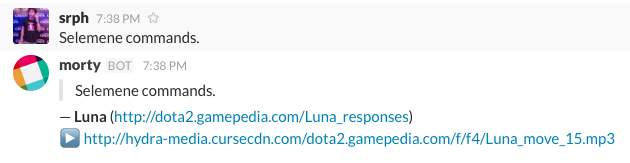

## dota2-responses-slack-bot [](https://travis-ci.org/srph/dota2-responses-slack-bot)
A Slack bot referencing Dota 2 responses to appropriate chat messages.


## Running
```bash
npm i
npm start
```

## Motivation
This project was motivated by [DotaResponsesRedditBot](https://github.com/Jonarzz/DotaResponsesRedditBot) by [Jonarzz](https://github.com/Jonarzz).